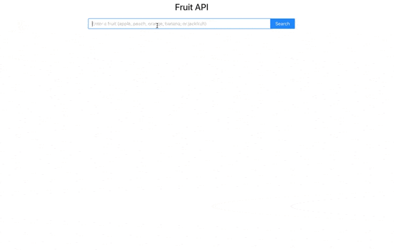

## Quick start for this full stack app: 

 1) npm install in the client and server folders

 2) npm start in server, and then npm start in client folder.

## App
This is a full stack application with an API server created with Node/Express, and a front end built with React.

Currently, you can search 5 fruits: Apple, Banana, Peach, Orange, and Jackfruit. 

## Preview
